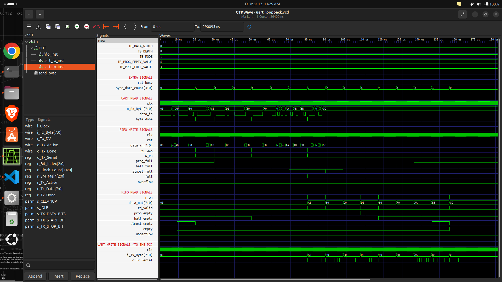
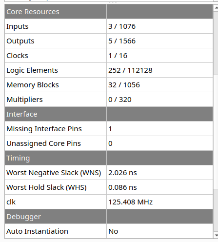

# UART ↔ Sync FIFO Loopback Test

This example demonstrates **UART communication through the Sync FIFO IP** using a **loopback test**.
Data is sent from the host PC to the FPGA, stored in the **Sync FIFO**, and transmitted back through UART.

The script compares transmitted and received data to verify **data integrity and FIFO operation**.

---

## Hardware Platform

Verified on:

```
Vicharak Vaaman FPGA Board
```

Communication interface:

```
UART over USB (/dev/ttyUSB0)
Baud Rate : 1000000
```

---

## Test Architecture

```
Host PC
   │
   │ UART
   ▼
UART RX (FPGA)
   │
   ▼
Sync FIFO
   │
   ▼
UART TX (FPGA)
   │
   │ UART
   ▼
Host PC
```

---

## Running the Test Script

A Python script is provided to send data to the FPGA and verify the returned data.

Run the script from the scripts directory:

```
python3 send.py
```

---

## Script Usage

For detailed instructions on how to use and configure the test script, refer to:

[Script README](scripts/README.md)

This document explains:

* Script configuration
* Data generation
* UART communication
* Output files
* Data verification process

---

## Simulation / Hardware Results

### Simulation Waveform



### Resource Utilization



---

## Notes

* FIFO depth and data width must match the FPGA configuration.
* UART baud rate must match the UART module used in the FPGA design.
* The FPGA design must return received data to support loopback verification.
* Sync FIFO operates using a **single clock domain for both read and write operations**.
